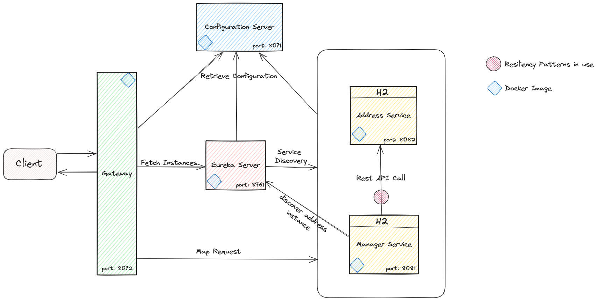

# Technical Test
**Yadier Betancourt**
## 1. High-level description
The purpose of this application is to have a microservices architecture for managing addresses and managers.

The provided services are:
- Configuration Server: This microservice is responsible for managing the configuration of the other microservices 
- Eureka Server: This microservice is responsible for service discovery and registration
- Gateway: This microservice is responsible for routing requests to the appropriate microservices 
- Address Service: This microservice is responsible for managing addresses
- Manager Service: This microservice is responsible for managing managers

### 1.1. Simple Diagram



### 1.2. Domain Model Explanation
This section delves into the core entities that represent the problem domain in our microservices architecture.
#### 1.2.1. Address Entity

The Address entity represents a physical location. It is managed by the Address Service and has the following attributes:

- id (Long): Unique identifier for the address (primary key). Auto-generated by the database.
- direction (String): Textual description of the address.
- enabled (Boolean): Flag indicating whether the address is active (true) or disabled (false).
- version (Long): Optimistic locking version number used for concurrency control.
- createdDate (Date): Timestamp representing the date and time the address was created. (automatically populated)
- lastModifiedDate (Date): Timestamp representing the date and time the address was last modified. (automatically updated)

#### 1.2.2. Manager Entity

The Manager entity represents an individual who manages a center. It is managed by the Manager Service and has the following attributes:
- id (Long): Unique identifier (primary key). Auto-generated by the database.
- name (String): Name of the manager.
- nif (String): Unique taxpayer identification number (NIF). (assumed to be unique)
- addressId (Long): "Foreign key" referencing the associated Address entity.
- enabled (Boolean): Flag indicating whether the manager is active (true) or disabled (false).
- version (Long): Optimistic locking version number used for concurrency control.
- createdDate (Date): Timestamp representing the date and time the manager was created. (automatically populated)
- lastModifiedDate (Date): Timestamp representing the date and time the manager was last modified. (automatically updated)
- authorizations (List<ManagerAuthorization>): One-to-Many relationship with ManagerAuthorization entities, representing the authorizations associated with the manager. (lazy fetching is used)

#### 1.2.3. ManagerAuthorization Entity

The ManagerAuthorization entity represents a many-to-many relationship between Manager and CenterAuthorization entities. It has a composite primary key consisting of managerId and authorizationId.

- id (Id): Embedded composite primary key containing:
  - managerId (Long): Foreign key referencing the associated Manager entity.
  - authorizationId (Long): Foreign key referencing the associated CenterAuthorization entity.
- manager (Manager): Reference to the associated Manager entity.
- authorization (CenterAuthorization): Reference to the associated CenterAuthorization entity.
- createdDate (Date): Timestamp representing the date and time the authorization was created. (automatically populated)

#### 1.2.4. CenterAuthorization Entity

The CenterAuthorization entity represents an authorization associated with a center. It is managed by the Manager Service and has the following attributes:

- id (Long): Unique identifier (primary key). Auto-generated by the database.
- authorizationNumber (String): Unique identifier for the authorization itself. (assumed to be unique)
- version (Long): Optimistic locking version number used for concurrency control.
- createdDate (Date): Timestamp representing the date and time the authorization was created. (automatically populated)
- lastModifiedDate (Date): Timestamp representing the date and time the authorization was last modified. (automatically updated)

## 2. Technology Stack
This project utilizes a combination of robust technologies to achieve its functionalities:

### 2.1. Spring Boot

Spring Boot serves as the foundational framework for developing microservices, streamlining the development process and providing a comprehensive set of features.

### 2.2. Spring Data JPA

Spring Data JPA facilitates seamless interaction with the in-memory H2 database, enabling effortless data persistence and retrieval.

### 2.3. H2 Database

H2 acts as the in-memory database, offering a lightweight and efficient solution for storing and managing application data.

### 2.4. Resilience4j

Resilience4j enhances the application's resilience by providing mechanisms to gracefully handle failures and maintain system stability.

### 2.5. Swagger UI

Swagger UI empowers developers with a user-friendly interface to explore and interact with the REST APIs, simplifying API consumption.

### 2.6. Flyway DB

Flyway DB streamlines database migrations, ensuring consistent database schema versions across environments.

### 2.7. Docker Compose:

Docker Compose simplifies the orchestration of Docker containers, enabling easy deployment and management of the microservices architecture.

## 3. Development Mode Setup

### 3.1. Prerequisites
- Java 21: Ensure you have Java 21 installed on your system.

### 3.2. Running the Microservices

Build the Microservices: Open a terminal window and navigate to the project directory. Execute the following command to build all the microservices:
```bash
mvn clean install
```
Start the Microservices: With the microservices built, you can start them individually in your preferred IDE. Maintain the specified startup order to ensure proper initialization and communication between services:
1. Configuration Server
2. Eureka Server
3. Address Service
4. Manager Service
5. Gateway Server

### 3.3. Access the Services

The Gateway Server acts as the entry point for external requests. It can be accessed at http://localhost:8072/.
To explore the Address Service APIs, navigate to http://localhost:8072/address-service/address
To explore the Manager Service APIs, navigate to http://localhost:8072/manager-service/manager and http://localhost:8072/manager-service/center-authorization

#### 3.3.1 Swagger UI:
1. Address Service: To explore the Address Service APIs using Swagger UI, navigate to http://localhost:8081/swagger-ui/index.html#/
2. Manager Service: To explore the Manager Service APIs using Swagger UI, navigate to http://localhost:8082/swagger-ui//index.html#/

**Important Note**: When creating a Manager through the Manager Service API, keep in mind that the Manager entity requires a reference to an existing Address and one or many CenterAuthorization. Ensure you have already created these entities through their respective APIs before creating a Manager.

## 4. Production Deployment with Docker Compose

This section outlines the steps for deploying the microservices to a production environment using Docker Compose.

### 4.1. Prerequisites

Docker Installation: Ensure Docker is installed and configured on your system. You can verify Docker installation using the command docker info.

Built and packaged Microservices: Make sure you have built and packaged the microservices using the command `mvn clean package` in the root directory of each microservice project.

**Note**: Since the microservices have already been built and packaged, you can directly proceed to the Running the Microservices with Docker Compose.

### 4.2. Deployment Steps

Navigate to Project Root: Open a terminal window and navigate to the root directory of the project. This directory should contain the docker-compose.yml file.

Initiate Docker Compose: Execute the following command to start the microservices using Docker Compose:
```bash
docker compose up -d
```

### 4.3. Access Services
Once the microservices are up and running, you can access the Gateway Server, which serves as the entry point for external requests, at http://localhost:8072/.
To explore the Address Service APIs, navigate to http://localhost:8072/address-service/address
To explore the Manager Service APIs, navigate to http://localhost:8072/manager-service/manager and http://localhost:8072/manager-service/center-authorization

**Important Note**: When creating a Manager through the Manager Service API, keep in mind that the Manager entity requires a reference to an existing Address and one or many CenterAuthorization. Ensure you have already created these entities through their respective APIs before creating a Manager.
